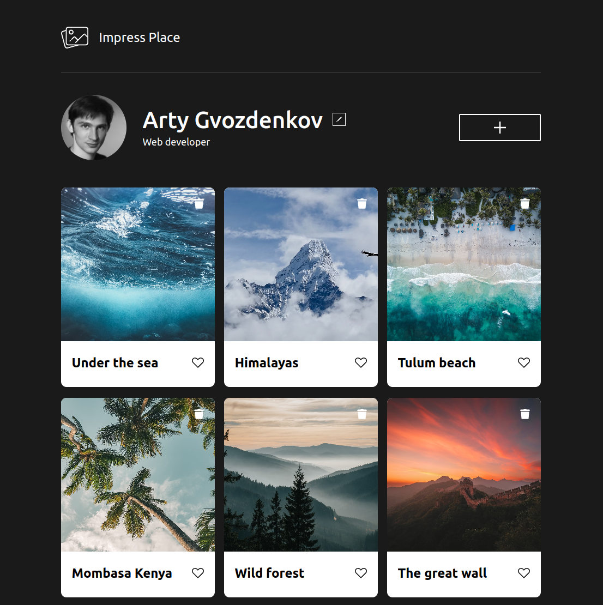

# Impress Place frontend

<div align="center">
  <a href="https://gvozdenkov.github.io/algoschool/">
    
  </a>
  <br/><br/>
  <p align="center">Share photos of amazing places with your friends</p>
  <br/>
</div>

[Превью на GitHub Pages](https://gvozdenkov.github.io/impress-place-frontend/)

Парная разработка: Напарник Богдан Сутужко
([GitHub аккаунт](https://github.com/julfy-bs)) почта: julfy.web@gmail.com

## О проекте

Учебный фронтенд проект. Написан на фреймворке
[`vanilla JS`](http://vanilla-js.com/) :smile: "Социальная фото сеть" интересных
мест. Пользователь может добавлять фотографии, лайкать чужие, изменять свои
данные профиля. Функционал регистрации и логина тут ещё не реализован. Проект
ничем не примечателен, кроме того, что написан на чистом JS.



## Функциональность

- [x] Добавить картинку места
- [x] Редактировать данные пользователя - Имя и О себе
- [x] Изменить аватар пользователя
- [x] Поставить лайк карточке места
- [x] Отображение количества лайков на карточке
- [x] Улучен UX - отображается процесс загрузки при отправке форм

- [ ] Регистрация нового пользователя
- [ ] Свой бэкенд
- [ ] Деплой на свой хостинг

## Техники

:boom: ООП подход к построению компонентов. Внедрил Внедрение зависимостей (DI).
Классы принимают функции-обработчики извне, тем самым могут гибко меняться.

Например, класс `Profile` отвечает за добавление фото, редактирование и
отображение данных профиля. Он принимает извне селекторы и обработчики клика на
кнопки редактирования разных данных профиля:

```js
profile.setEventListeners([
  {
    selector: popupConfig.editAvatarButtonSelector,
    handleClick: handleEditAvatarClick,
  },
  {
    selector: popupConfig.editProfileButtonSelector,
    handleClick: handleEditProfileClick,
  },
  {
    selector: popupConfig.addCardButtonSelector,
    handleClick: handleAddCardClick,
  },
]);
```

:boom: Все константы и конфиги вынесены отдельно

:boom: Использую `SCSS` для написания стилей. Применил миксины и функции `SCSS`.
Настроил горячую компиляция в режиме разработки.

:boom: Автоматически оптимизирую `svg` картинки при сборке `Webpack` с помощью
плагина `ImageMinimizerPlugin` и `svgo`

:boom: Погрузился в настройку `Webpack`. Настроил сборку в `dev` и `production`
режимах

## Локальная разработка

```bash
git clone git@github.com:gvozdenkov/impress-place-frontend.git

cd impress-place-frontend

cp .env.example .env

npm ci

npm run dev

# open http://localhost:8081/
```

## Скрипты

| script   | Description                                         |
| -------- | --------------------------------------------------- |
| `format` | форматирует весь код в `/src` с помощью `prettier`  |
| `build`  | Сборка проекта в папку `/build` с помощью `Webpack` |
| `dev`    | борка проекта в `dev` режиме с помощью `Webpack`    |
| `deploy` | Сборка проекта и деплой на `GitHub Pages`           |

## Планы по развитию

- [ ] Перевезти проект на [Remix.run](https://remix.run/) фреймворк.
- [ ] Добавить [линтер](https://github.com/feature-sliced/steiger) для
      методологии
      [FSD](https://feature-sliced.design/ru/docs/get-started/overview)
- [ ] Добавить функционал регистрации и авторизации
- [ ] Авторизация с помощью аккаунтов Goolge, Yandex и ВК
- [ ] Изменение интерфейса под загрузку файлов изображений, а не ссылок
- [ ] Перевезти фронтед в монорепозиторий под управлением
      [`Nx`](https://nx.dev/)
- [ ] Тестирование и разработка компонентов UI с помощь
      [`Cypress Component Testing`](https://docs.cypress.io/guides/component-testing/overview)
      и [`Storybook`](https://storybook.js.org/)

<details>
<summary>История версий</summary>

## Изменения в версии 1.2.0

- Переработали код в ООП парадигме
- Добавили алерт с ошибкой

## Изменения в версии 1.1.0

- Валидация всех форм. Модуль validate.js
- Подключен внешний API для хранения всех данных сервиса
- Все изменяемые данные сохраняются на сервере
- Попап подтверждения удаления карточки
- структурно разделена отрисовка элементов и работа с API

## Версия 1.0.0

Исходные 6 карточек генерируются с помощью JS (эмуляция загрузки с сервера)

Добавлена функциональность фронтенда. Без БД:

1. Попап Редактировать профиль - вносит изменение на странице в профиль
2. Попап Добавить место - добавляет новую кароточку с фото места
3. У кароточек работает лай
4. Карточку можно удалить (корзина в угул карточки)
5. При клике на фото карточки появляется попап с картинкой кароточки

</details>
